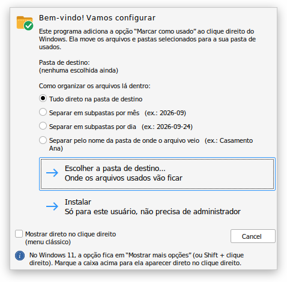
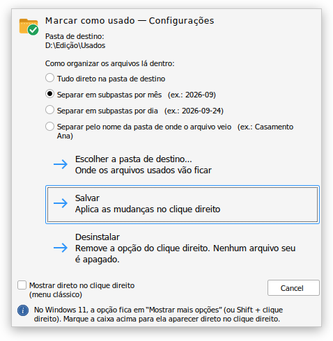

<div align="center">


# Marcar como usado

**Move arquivos e pastas para a sua pasta de "usados" direto pelo clique direito do Windows.**<br>
Feito para quem trabalha com edição de vídeo e acumula material bruto, takes e exports.


[**⬇ Baixar a última versão**](../../releases/latest)

</div>

---

## O que ele faz

Você seleciona os arquivos, clica com o botão direito e eles vão para a pasta de usados:

```
Clique direito em arquivos ou pastas
└── Marcar como usado  ▸  Mover para  D:\Edição\Usados
                          Mover para outra pasta...
                          ─────────────────────────
                          Configurações...
```

- **Vários arquivos de uma vez:** selecione 5 ou 500. Tudo é movido num lote só, com a janela de progresso do próprio Windows.
- **Nunca sobrescreve:** se já existir `clip.mp4` no destino, o novo vira `clip (2).mp4`.
- **Organização automática:** tudo junto, por mês, por dia ou pelo nome da pasta de origem.
- **Registro de onde veio cada arquivo:** um `_registro_usados.csv` (abre no Excel) guarda o caminho original de tudo que foi movido.
- **Arquivo aberto no editor?** O Windows avisa que ele está em uso e deixa tentar de novo ou pular.
- **Um único `.exe`:** não pede administrador, não instala nada além dele e sai limpo na desinstalação.

<div align="center">
<table>
<tr>
<td align="center"><br><sub>Primeira vez: escolher a pasta e instalar</sub></td>
<td align="center"><br><sub>Configurações (clique direito → Marcar como usado → Configurações…)</sub></td>
</tr>
</table>
<sub><i>Capturas feitas no Wine. No Windows as janelas seguem o visual do sistema.</i></sub>
</div>

## Instalação

1. Baixe o `Usados.exe` na página de [Releases](../../releases/latest).
2. Dê dois cliques nele.
   > Se aparecer **"O Windows protegeu o computador"**, clique em **Mais informações → Executar assim mesmo**. O aviso aparece porque o programa não tem assinatura digital paga.
3. Clique em **Escolher a pasta de destino…** e escolha onde os arquivos usados vão ficar.
4. Escolha como organizar e clique em **Instalar**.

Pronto. O programa se copia para `%LOCALAPPDATA%\Programs\Usados`, então o arquivo baixado já pode ser apagado.

## Como usar

Selecione um ou vários arquivos/pastas → **clique direito** → **Marcar como usado** → **Mover para …**

> **Windows 11:** a opção fica em **"Mostrar mais opções"** (ou segure **Shift** ao clicar com o botão direito).
> Para ela aparecer direto no primeiro menu, marque **"Mostrar direto no clique direito (menu clássico)"** nas Configurações. Isso traz de volta o menu completo do Windows 10 para o seu usuário, e dá para desmarcar quando quiser.

| Opção do menu | O que acontece |
|---|---|
| **Mover para `<sua pasta>`** | Move para a pasta configurada, organizando do jeito escolhido |
| **Mover para outra pasta...** | Pergunta a pasta na hora (e lembra a última escolhida) |
| **Configurações...** | Troca a pasta de destino, a organização ou desinstala |

### Jeitos de organizar

| Opção | Exemplo de onde o arquivo vai parar |
|---|---|
| Tudo direto na pasta de destino | `D:\Edição\Usados\clip.mp4` |
| Subpastas por mês | `D:\Edição\Usados\2026-09\clip.mp4` |
| Subpastas por dia | `D:\Edição\Usados\2026-09-24\clip.mp4` |
| Pelo nome da pasta de origem | `D:\Edição\Usados\Casamento Ana\clip.mp4` |

### O registro `_registro_usados.csv`

Fica na raiz da pasta de destino e ganha uma linha por item movido:

| Data | Tipo | Nome | Caminho original | Caminho novo |
|---|---|---|---|---|
| 24/09/2026 14:50:05 | Arquivo | take_12.braw | `E:\Jobs\Casamento Ana\take_12.braw` | `D:\Edição\Usados\2026-09\take_12.braw` |

Para não gravar esse arquivo, defina `RegistrarCsv = 0` em `HKEY_CURRENT_USER\Software\Usados`.

## Desinstalar

**Configurações do Windows → Aplicativos → Aplicativos instalados → "Usados (Marcar como usado)" → Desinstalar**,
ou pelo botão **Desinstalar** nas Configurações do programa.

A pasta de usados e tudo o que está dentro dela **não são apagados**.

## Perguntas frequentes

<details>
<summary><b>Mover para um HD externo demora. É normal?</b></summary>

Sim. Dentro do mesmo disco, mover é instantâneo (o Windows só muda o endereço do arquivo). Para outro disco, o Windows precisa copiar e depois apagar o original, igual a arrastar no Explorer. A janela de progresso mostra o andamento.
</details>

<details>
<summary><b>E se o HD de destino estiver desconectado?</b></summary>

O programa avisa que não conseguiu acessar a pasta de destino e não mexe em nada.
</details>

<details>
<summary><b>Mais de uma pessoa usa o computador. Funciona?</b></summary>

Sim. Tudo fica no perfil de cada usuário do Windows (`HKEY_CURRENT_USER`). Cada pessoa instala no próprio usuário e escolhe a própria pasta.
</details>

<details>
<summary><b>Dá para desfazer?</b></summary>

O `_registro_usados.csv` mostra o caminho original de cada item, então dá para devolver manualmente. Um botão de "devolver" automático é uma boa ideia para uma próxima versão.
</details>

<details>
<summary><b>Por que a opção não aparece direto no clique direito do Windows 11?</b></summary>

O menu novo do Windows 11 só mostra opções de programas registrados como pacote do Windows (MSIX) com assinatura digital. Por isso a opção fica em "Mostrar mais opções", como acontece com a maioria dos programas pequenos. A caixinha "menu clássico" nas Configurações resolve isso para quem prefere o menu completo.
</details>

---

## Para desenvolvedores

### Compilar no Windows

1. Instale o Rust: <https://rustup.rs> (aceite a instalação do *Visual Studio Build Tools*).
2. Na pasta do projeto:
   ```powershell
   cargo build --release
   ```
3. O programa sai em `target\release\usados.exe`.

### Compilar no Linux (cross-compile)

```bash
sudo apt install mingw-w64
rustup target add x86_64-pc-windows-gnu
cargo build --release --target x86_64-pc-windows-gnu
```

### Estrutura

| Arquivo | O que faz |
|---|---|
| [`src/main.rs`](src/main.rs) | Lê a linha de comando e decide o que fazer |
| [`src/ui.rs`](src/ui.rs) | Janelas nativas: configurações, mensagens e seletor de pasta (`TaskDialog`, `IFileOpenDialog`) |
| [`src/config.rs`](src/config.rs) | Configurações no registro, instalar/desinstalar, menu do clique direito, menu clássico do Win 11 |
| [`src/fila.rs`](src/fila.rs) | Junta os vários arquivos selecionados num lote só |
| [`src/mover.rs`](src/mover.rs) | Move de verdade (`IFileOperation`, o mesmo mecanismo do Explorer) e grava o CSV |
| [`src/util.rs`](src/util.rs) | Datas, nomes sem repetição e comparação de caminhos |
| [`res/`](res/) | Ícone, manifesto (visual moderno, sem admin, DPI) e informações de versão |

### Linha de comando

```text
Usados.exe                      tela de configurações / instalação
Usados.exe --config             idem
Usados.exe --mover "arquivo"    move para a pasta configurada
Usados.exe --mover-para "arq"   pergunta a pasta e move
Usados.exe --desinstalar        desinstala
Usados.exe arq1 arq2 ...        igual a --mover (arrastar arquivos em cima do .exe)
```

### Como funciona a seleção de vários arquivos

Quando você seleciona 50 arquivos, o Windows abre o programa **50 vezes**, uma por arquivo. Para virar um lote só:

1. Cada cópia anota o seu arquivo em `%LOCALAPPDATA%\Usados\fila` (grava como `.tmp` e renomeia, para ninguém ler um pedido pela metade).
2. Cada cópia tenta pegar um mutex. **Só uma consegue** e vira a "trabalhadora". As outras fecham na hora.
3. A trabalhadora espera ~0,5 s sem pedidos novos e move tudo de uma vez.
4. Ao terminar, ela solta o mutex e confere a fila de novo, para não perder um pedido que chegou no último instante.

O menu usa `MultiSelectModel = Player` para continuar aparecendo com mais de 15 itens selecionados (o limite padrão do Windows).

### O que fica no registro

Tudo em `HKEY_CURRENT_USER`:

| Chave | Para quê |
|---|---|
| `Software\Usados` | Configurações: `Destino`, `Organizacao` (0–3), `RegistrarCsv` (0/1) |
| `Software\Classes\AllFilesystemObjects\shell\Usados` | O submenu do clique direito |
| `Software\Microsoft\Windows\CurrentVersion\Uninstall\Usados` | Entrada em "Aplicativos instalados" |
| `Software\Classes\CLSID\{86ca1aa0-34aa-4e8b-a509-50c905bae2a2}` | Só se o menu clássico do Windows 11 for ativado |

### Ideias para próximas versões

- [ ] "Devolver para a pasta original" usando o `_registro_usados.csv`

## Licença

Distribuído sob a licença MIT. Veja o arquivo [LICENSE](LICENSE).